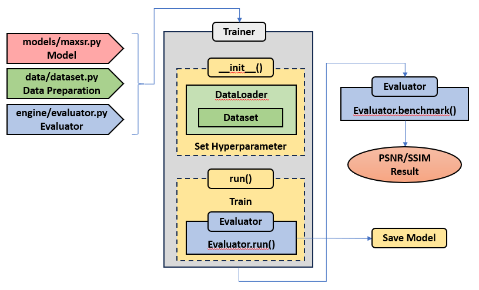

# StudioSR
StudioSR is a Pytorch library providing implementations of training and evaluation of super-resolution models. StudioSR aims to offer an identical playground for modern super-resolution models so that researchers can readily compare and analyze a new idea. (inspired by [PyTorch-StudioGan](https://github.com/POSTECH-CVLab/PyTorch-StudioGAN))


## Installation
The current recommended way to install StudioSR is from source.

### From source
```bash
git clone https://github.com/veritross/studiosr.git
cd studiosr
python3 -m pip install -e .
```
Don't forget the `.` at the end!


## Documentation
Documentation along with a quick start guide can be found in the [docs/](./docs/) directory.


## Pipeline Architecture
<p align="center">
  
</p>


## File Directory Structure
├───studiosr  
│   ├─data  
│   │ ├───dataset.py  
│   │ ├───transforms.py  
│   │ └───...  
│   ├─engine  
│   │ ├───trainer.py  
│   │ ├───evaluator.py  
│   │ └───...  
│   ├─models  
│   │ ├───srcnn.py  
│   │ └───...  
│   ├─utils  
│   │ ├───tools.py  
│   │ └───...  
├───scripts  
│   ├───extract_subimages.py  
│   └───...  


## License
StudioSR is an open-source library under the **MIT license**. 
