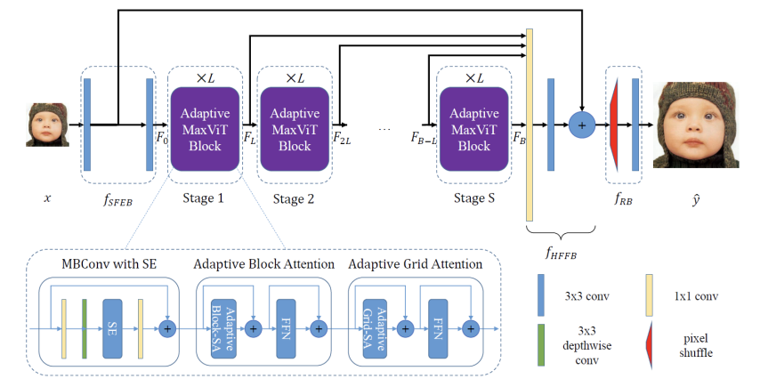

## Examples

### Train
```python
from studiosr import Evaluator, Trainer
from studiosr.data import PairedImageDataset
from studiosr.models import SRCNN

scale = 4
size = 64
batch_size = 32

gt_path = "/data/DIV2K_train_HR"
lq_path = "/data/DIV2K_train_LR_bicubic/X4"
dataset = PairedImageDataset(gt_path, lq_path, size, scale, True, True)

evaluator = Evaluator(scale=scale)
model = SRCNN(scale=scale)
trainer = Trainer(model, dataset, evaluator, batch_size=batch_size)
trainer.run()
```

### Evaluate
```python
import torch

from studiosr import Evaluator
from studiosr.models import SwinIR

scale = 4
device = "cuda" if torch.cuda.is_available() else "cpu"
model = SwinIR.from_pretrained(scale=scale).eval().to(device)
evaluator = Evaluator("Set5", scale=scale)
evaluator.run(model.inference)
```

### Benchmark
```python
import torch

from studiosr import Evaluator
from studiosr.models import SwinIR

scale = 4
device = "cuda" if torch.cuda.is_available() else "cpu"
model = SwinIR.from_pretrained(scale=scale).eval().to(device)
Evaluator.benchmark(model.inference, scale=scale)
```

## Models

### MaxSR: Image Super-Resolution Using Improved MaxViT
<p align="center">
  
</p>
